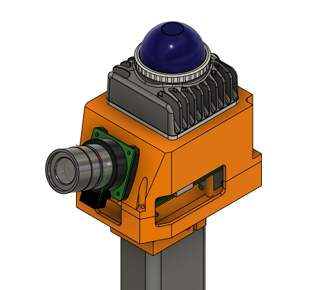

# Handheld Setup for Recording with Mid360 Lidar and Camera

This repository contains the STL files and software to build a recording device with the Livox MID-360 LiDAR, a Raspberri Pi 4 + an official High Quality Global Shutter Camera.
It is inspired from the excellent [mandeye_controller](https://github.com/JanuszBedkowski/mandeye_controller?tab=readme-ov-file) and derives much of the hardware design choices from it.

> With this note I also want to express my gratitude to the authors and maintainers of this repository!

The **key differences** are

- While much of the networking related setup needs to be done on the host, the driver software itself is **entirely containerized** with convenient wrapper scripts so you only have to kick off the build!
- The recording process is entirely **controlled via a flask webapp** meaning you do not need to install or use GPIO and associated hardware, the only soldering I required was the power distribution board!
- Thanks to **DNS hijacking** and the webapp providing a **captive portal**, you will be automatically redirected to the front page to get started immediately!
- The software is **built around ROS2** and can therefore export all data to rosbags. 
- You can choose to export LiDAR message data as `sensor_msgs/msg/PointCloud2` or [`livox_ros_driver2/msg/CustomMsg`](https://github.com/Livox-SDK/livox_ros_driver2/blob/master/msg/CustomMsg.msg) as you wish.
- It provides seamless **camera integration**.



## Hardware

You will need the following

- A Raspberry Pi 4 (8GB RAM recommended) + SD card (32GB minimum, 64GB recommended)
- A USB Flash Drive with at least 64GB (you want to store a lot of data on it!), I am using a 128GB one
- Livox [MID-360 LiDAR](https://www.livoxtech.com/mid-360) + [aviation connector](https://store.dji.com/pl/product/livox-three-wire-aviation-connector?vid=117441&from=search-suggestion&position=1&total_result=13)
  - this stuff goes out of stock quite fast, so you may need to set up restocking notifications!
- A high-quality [Raspberry Pi global shutter camera](https://www.raspberrypi.com/products/raspberry-pi-global-shutter-camera/) plus a lens of your choosing
- A [DJI BG30 Battery Gimbal Handle](https://store.dji.com/pl/product/ronin-bg30-grip?vid=97101&set_region=PL&from=site-nav) (or your own power supply with 16V, 4A)
- A [6V-20V to 5V buck converter](https://bauer-united.com/en/products/dc-dc-8v-32v-zu-5v-3a-usb-type-c-spannungswandler), I am using one with USB-C because it is easier
- Screws (& Hex Nuts)
  - M3x16, 1pc. + hex nut (power adapter clamping mechanism)
  - M4x10, 7pcs. + hex nuts & washers (power adapter + case)
  - M2x16, 4pcs. + hex nuts & washers (camera mount)
  - M2x4, 4pcs. + washers (raspberry pi mount)
  - LiDAR screws come with the product, but they are M3x8/M3x6 4pcs.

## Setup on Host-OS

Install Raspberry Pi OS *Bookworm* or later.
It is important to **use the 64bit** version to maintain [compatibility with the Livox-SDK](https://github.com/Livox-SDK/livox_ros_driver2/issues/130).

You also need to

- Configure the **LiDAR ethernet network to use a static IP** `196.168.1.2` 
- Configure that same ethernet network to be a **priority above the WiFi** network
- Configure **automounting of USB flash drives**
  - for desktop-based OS, this is done automatically after the first insertion of the drive
  - your drive **must be listed** under `/media/${USER}/<drive-name>`, only that way the webapp will find it!
  - reboot once, leaving the flash drive plugged in and make sure it is still accessible

### Creating a WiFi hotspot

I have basically followed [Host a Wi-Fi hotspot with a Raspberry Pi](https://www.raspberrypi.com/tutorials/host-a-hotel-wifi-hotspot/).

And the hotspot that I have used is [TP-Link WN823N](https://www.tp-link.com/de/home-networking/adapter/tl-wn823n/) which is based on the `rtl8xxxu` chipset that is conveniently **supported out of the box on debian based systems**.

```bash
wifi hotspot ssid <hotspot name> password <hotspot password> ifname wlan0
```

#### Manually installing the `rtl8192eu` Chipset Driver

Some more info can be found on this [StackOverflow Thread](https://askubuntu.com/a/1212939)

### Setup DNS Hijacking

The built-in interface `wlan0` is used to host the hotspot.
First, a static IP is configured for that interface and then all traffic is being rerouted to that IP by the DHCP server `dnsmasq`.

> **NOTE:** this is assuming that the hotspot is hosted on `wlan0`.
> If this is not the case, replace the device name accordingly (see `$ nmcli device`).

```bash
# configure the static IP on the hotspot
# you can also find its name with "$ nmcli connection"
sudo nmcli connection modify <hotspot-name> ipv4.addresses 192.168.4.1/24
sudo nmcli connection modify <hotspot-name> ipv4.method manual
```
reset internal DNS settings to aviod namespace conflicts

```bash
sudo nmcli connection modify <hotspot-name> ipv4.ignore-auto-dns yes
sudo nmcli connection modify <hotspot-name> ipv4.dns ""
```

then restart the connection on device `wlan0`

```bash
sudo nmcli device reapply wlan0
```

Then configure `dnsmasq`, install it with

```bash
sudo apt-update && apt-install -yq dnsmasq
```

and create (or modify) a file named `/etc/dnsmasq.conf` with the below content

```conf
interface=wlan0
dhcp-range=192.168.4.10,192.168.4.100,12h
address=/#/192.168.4.
```

which tells the DNS to lease IPs in the range of `*.10` to `*.100` for 12 hours each (adapt accordingly).
Then enable `dnsmasq` to be active on system boot and restart it for changes to take effect.

```bash
sudo systemctl enable dnsmasq
sudo systemctl restart dnsmasq
```


## NGINX

```bash
sudo apt install -yq nginx
```

Save this as the default NGINX config, assuming `pi4` is the devices hostname (replace otherwise).

```nginx
# /etc/nginx/sites-enabled/flask
server {
        listen 80 default_server;
        server_name _;
        location / {
                proxy_pass http://127.0.0.1:8000;
                proxy_set_header Host $host;
                proxy_set_header X-Real-IP $remote_addr;
                proxy_set_header X-Forwarder-For $proxy_add_x_forwarded_for;
        }
}
```

then

```bash
sudo service nginx restart
```

and when inside the raspberry pi's hotspot, connect to the webpage using this link

> http://pi4.local


## Building the Docker Image

> **IMPORTANT:** this **will not work** if you are using the 32-bit OS, plus I have not tested it on a Rasperry Pi 5!
>
> - If you are using the 32-bit OS: don't
> - If you are using a Pi 5: should work with the base docker-image, but maybe a different version is needed.

First [install docker](https://docs.docker.com/engine/install/debian/), then follow the below steps.

### For Development

Some important peculiarities about the build-process itself:

- [libcamera_ros](https://github.com/christianrauch/camera_ros) is built with `cmake` via `colcon build`
- for this [raspberrypi/libcamera](https://github.com/raspberrypi/libcamera) is checked out at `6ddd79b` to remain compatible with the available versions of `meson` and `ninja` that can be loaded by `ros2/humble` via `apt`
- the (non-ros) livox-SDK is built with `make -j 8` such as to not overload the CPU and RAM during the build process (my Pi4 8GB would otherwise freeze up)

To build the development image & start a container from it, run

```bash
./scripts/docker/build_image.sh
# run_image is not needed if you just want to deploy
./scripts/docker/run_image.sh
```

#### Webinterface

To work on the webinterface, which launches & stops the ROS2 device nodes, the following steps need to be done inside the development container

- `source /opt/ros/$ROS_DISTRO/setup.bash`
- build the `recorder_runner` package with `/ros2/src/livo/recorder_runner/build.sh`
- go to `/ros2_ws/src/livo/webinterface` and `pip install -r requirements.txt`
- the total camera + LiDAR driver **build time may take up to 15 or 20 minutes**

from inside that folder, the development server can then be run with

```bash
python3 app.py
```

### For Deployment

To have the image and server start automatically, build the `delpoy` stage with

```bash
./scripts/docker/prod.sh
```

> **NOTE:** in order be able to access the webserver from a remote device (e.g. a smartphone),
> you will need to setup a **WiFi hotspot** and **install and setup nginx** (see more below)

## Webinterface Notes

**NOTE**: The flask webserver serves locally saved versions of bootstrap from local sources in `webinterface/static/bootstrap`.
See also: [bootstrap CDN links](https://www.jsdelivr.com/package/npm/bootstrap)

When hosting the service via WiFi hotspot, the client may not be able to connect to the internet to load external resources (like `fonts.googleapis.com`).


Currently, I am using `bootstrap@5.3.7`.
