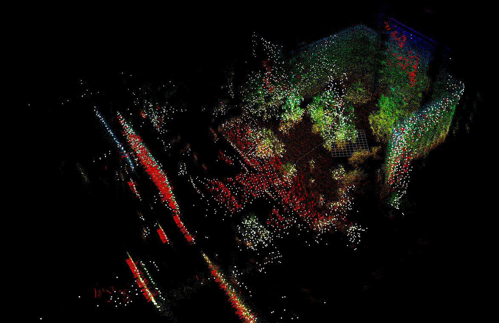
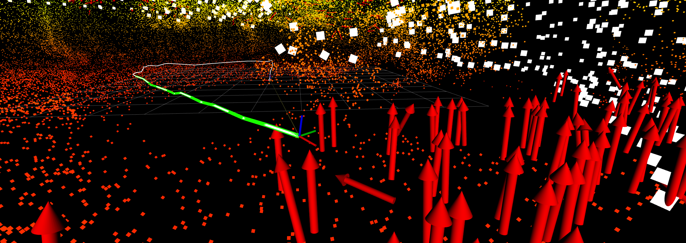

# Mapping

A point-to-plane based LiDAR inerital odometry using iSAM2 as a backend.

It is heavily inspired by the principles of [BA-LINS](), [MSC-LIO]() and I relied on some ideas from [Kimera-VIO](https://github.com/MIT-SPARK/Kimera-VIO) for the GTSAM integration.

Integrating tightly coupled vision - TBD.




#### Map
Birds-eye view of a map (colored) created simply by accumulating the pointcloud maps that were marginalized from the sliding window.
It is overlayed with the current keyframe submap (white) which is built from accumulating undistorted scans and arrow markers (red) indicating the origin and normal vector of the plane clusters that serve as GTSAM factors.

> **NOTE:** the system implements odometry and therefore does not do full-SLAM!

#### Closeup
The closeup shows the current pose (TF frame), the full estimated trajectory (white) and the part of the trajectory that currently resides within the smoothers sliding window (green).


## Quick Start

For real usage, build with

```bash
colcon build --symlink-install --packages-select mapping \
    --cmake-args -DCMAKE_BUILD_TYPE=Release
```

otherwise use `Development` or omit the build type.

> **NOTE:** in case the build fails because `libOpen3d` cannot be found, do this before building

```
export LD_LIBRARY_PATH=$LD_LIBRARY_PATH:/install/open3d-devel/lib
```

- bag reader mode: `$ ./build/mapper --config <path/to/config.yaml> --bag <path/to/bag>`
- node: currently via `ros2 launch mapping mapper_node.launch` (includes RViz)

### Configuration

If you want to know how the system works, it's probably a good idea to start out with the [config file](./config/mapping_mid360.yaml) and go from there.

### Sample Rosbags

Rosbags I recorded with this very setup can be found [here](https://drive.google.com/drive/folders/16HWhqn81sXnHMIYXJMcS7yg8begUQgFc?usp=sharing).

## Development

### Profiling with `gperftools`

Inside the docker container install

```bash
apt update && apt install -yq google-perftools libgoogle-perftools-dev graphviz
```

Build using `RelWithDebInfo`

```bash
colcon build --symlink-install --packages-select mapping --cmake-args -DCMAKE_BUILD_TYPE=RelWithDebInfo
```

Run the node in bag reader mode with the profiler

```bash
./scripts/gperf.sh --config config/mapping_mid360.yaml --bag /path/to/bag
```

Use `-o` to specify a custom output path (defaults to `/tmp/mapper_profile.prof`)

```bash
./scripts/gperf.sh -o /path/to/profile.prof --config config/mapping_mid360.yaml --bag /path/to/bag
```

Press `CTRL+C` to stop early — the profile data is flushed before the process exits.

### Process and visualize the profiling results

To process the profiling data, install the Go-based `pprof` inside the container
(the Perl-based `google-pprof` from apt is too slow for large debug binaries):

```bash
apt-get install -yq golang
GOBIN=/usr/local/bin go install github.com/google/pprof@v0.0.0-20240727154555-813a5fbdbec8
```

**NOTE:** `@latest` requires Go 1.24+, but Ubuntu 22.04 ships Go 1.18, so we pin an older compatible version.

Convert the profiling data to protobuf format and copy it to the host:

```bash
pprof -proto ./build/mapper /tmp/mapper_profile.prof > /tmp/profile.pb.gz
```

```bash
docker cp mapping-dev:/tmp/profile.pb.gz .
```

Visualize by dropping `profile.pb.gz` into [speedscope](https://www.speedscope.app/),
or with the Go-based pprof web UI:

```bash
pprof -http=:8080 profile.pb.gz
```

### Cleaning up `colcon-clean`

From inside the docker container, you can install (might need pip3 first).
AFAICT, colcon-clean is the ROS2 euqivalent to `catkin_make clean`.

```bash
# may need $ apt install -yq python3-pip
pip install colcon-clean
```

and clean up this package with

```bash
colcon clean packages \
    --base-select \
        build \
        install \
    --packages-select mapping
```